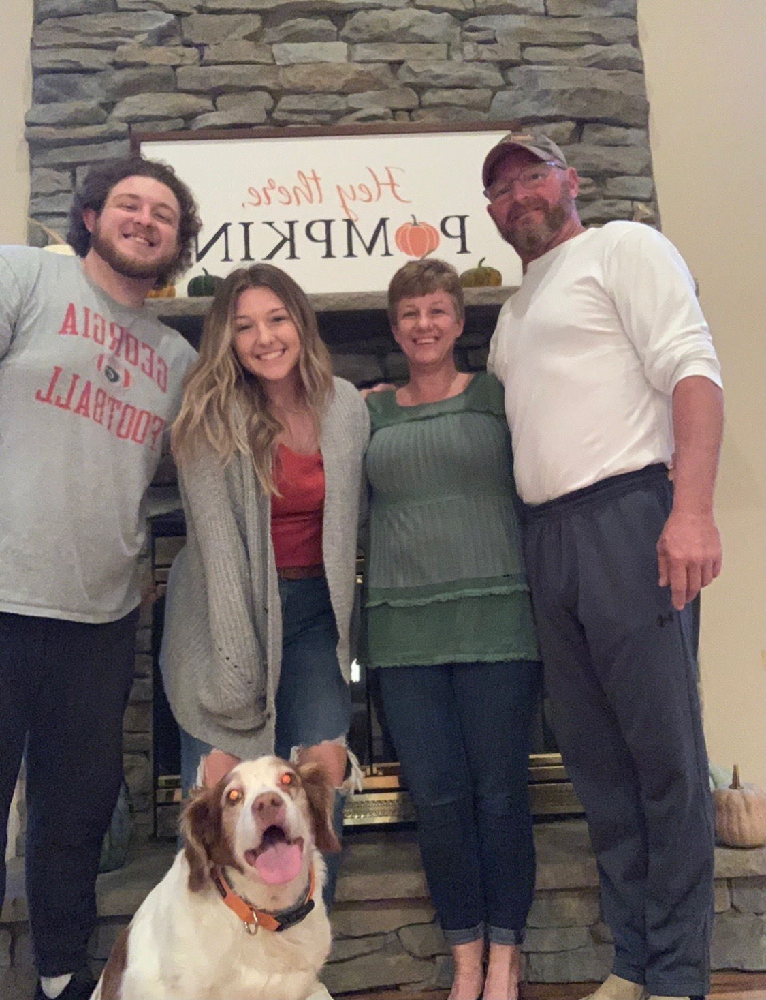
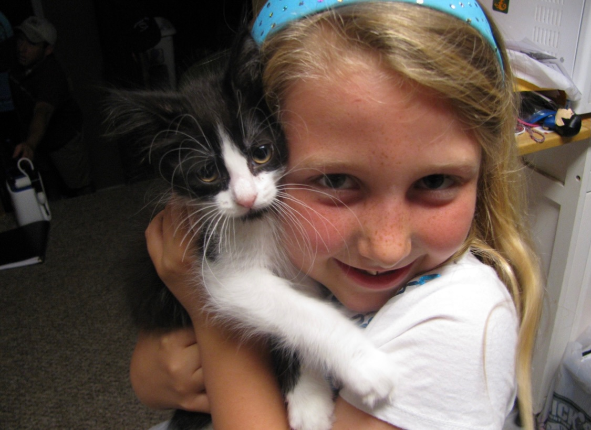
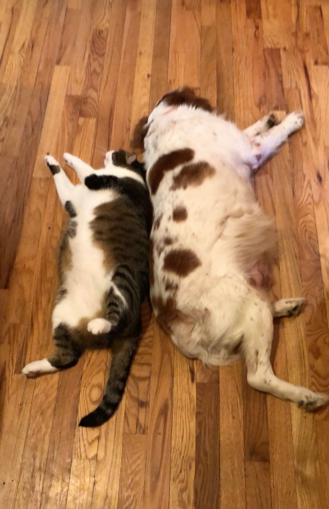
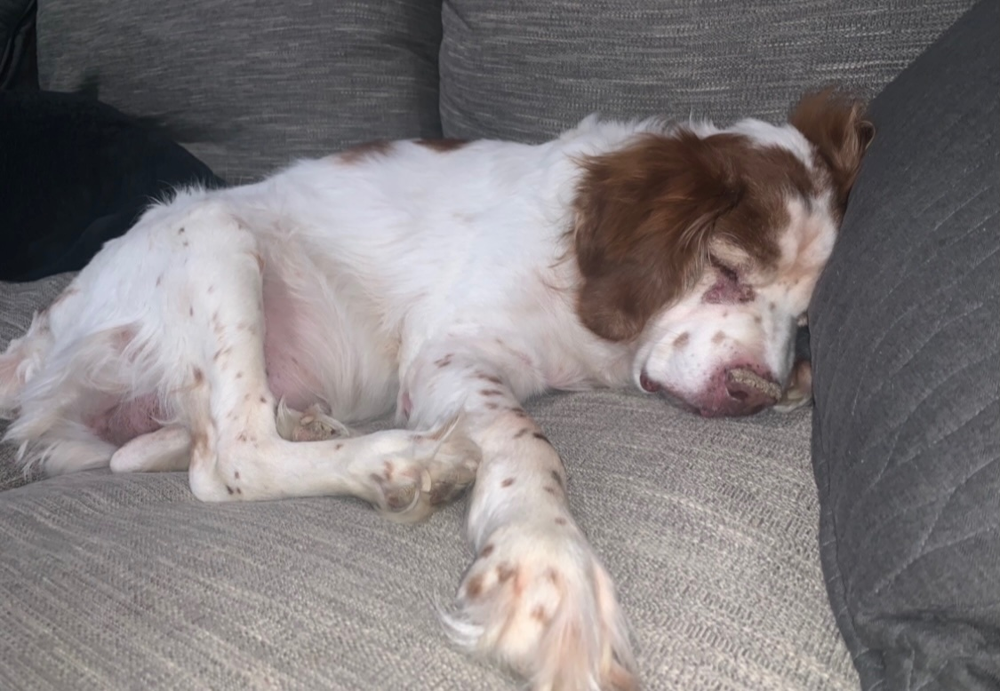

[Home](./)
 # About me :)

## Background
#### Schooling
I originally attended Abington Heights high school in Pennsylvania, and I am now currently a sophomore computer science major at Quinnipiac University.

#### Experience
I took my first computer science class sophomore year of high school. My school had advertised it as being a good course for people who were "technologically inclined" and liked computers, so I signed up having no idea what computer science even was. From there, my teacher encouraged me to take AP Computer Science the next year. I then ended up competing in a local coding contest and also took an Android app development course senior year and realized this was something I could see myself majoring in. Now, I am pursuing computer science in college and hope to continue taking interesting and challenging courses to grow my skills.

#### Interests
Aside from coding, I have a broad span of interests ranging from crystals and astrology to musicals and Taylor Swift. I also like hanging out with my pets and I actually love doing school work.

## Quick Facts

- Age: 19
- Birthday: July 18th
- Zodiac Sign: Cancer
- Favorites: Can't pick favorites
- Siblings: 1
- Pets: 4

## Photo Dump!
##### Family Photo
(ft. my cute pups Hank)

##### Maddie and Oreo Glow Up

##### Fat Cat Joey and Pups

##### Sleepy Pups Hank

